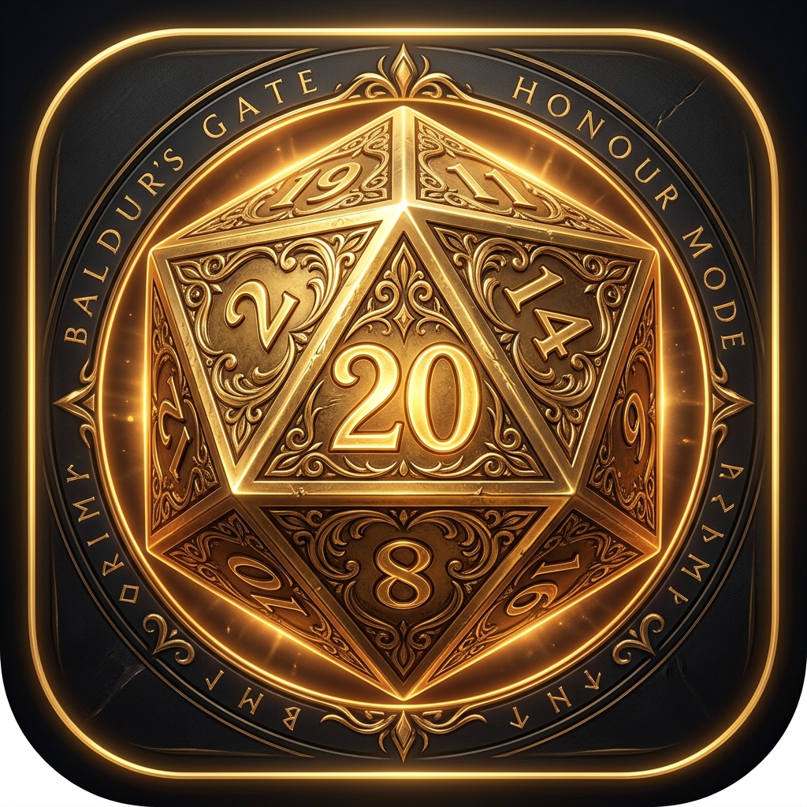
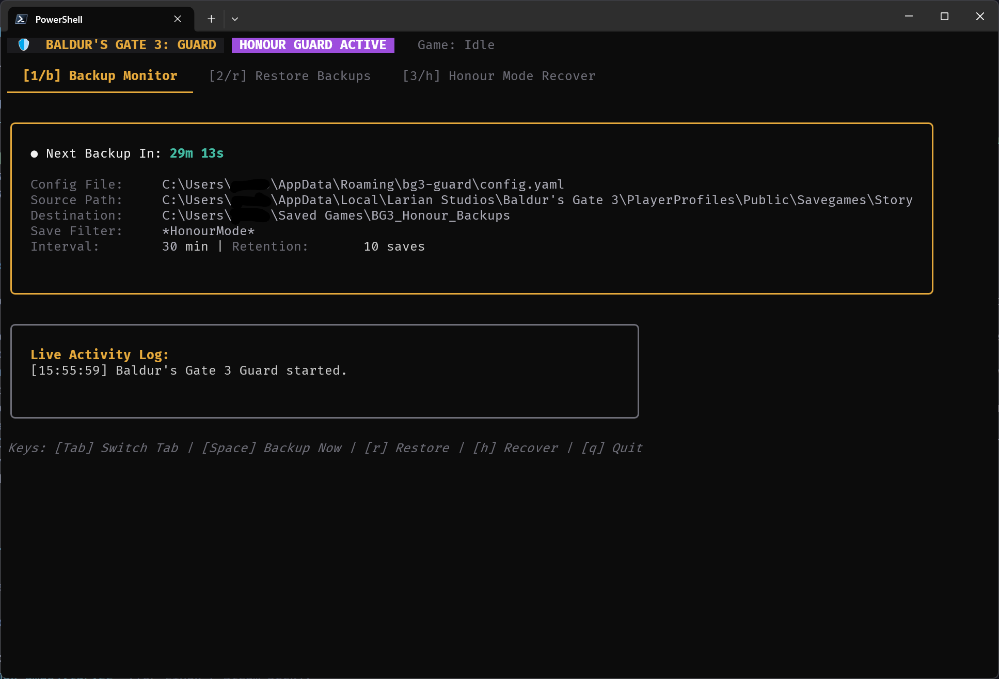
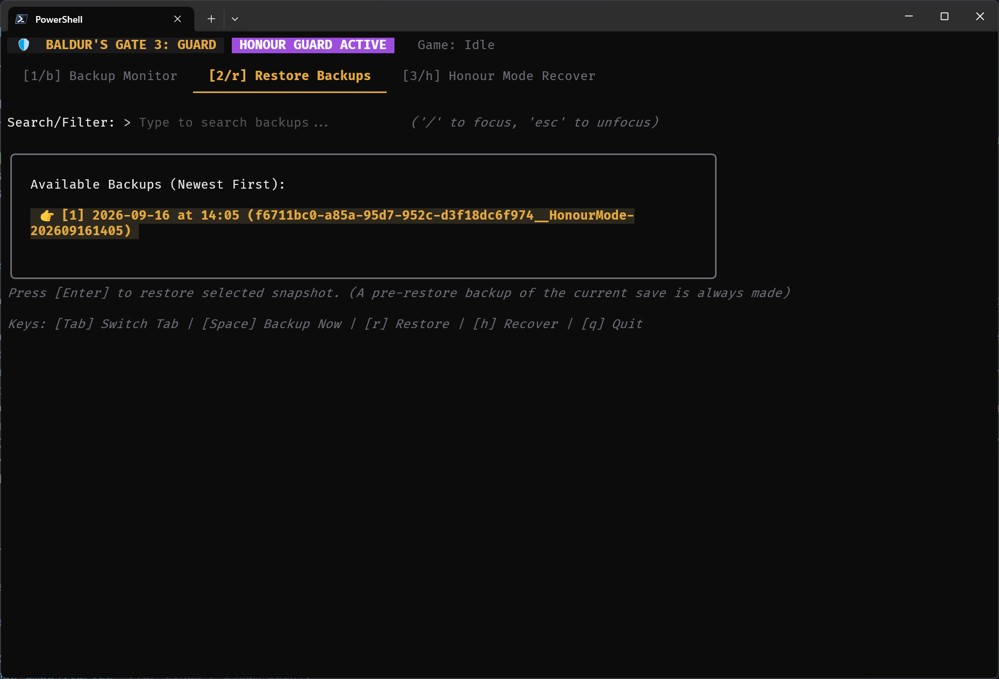
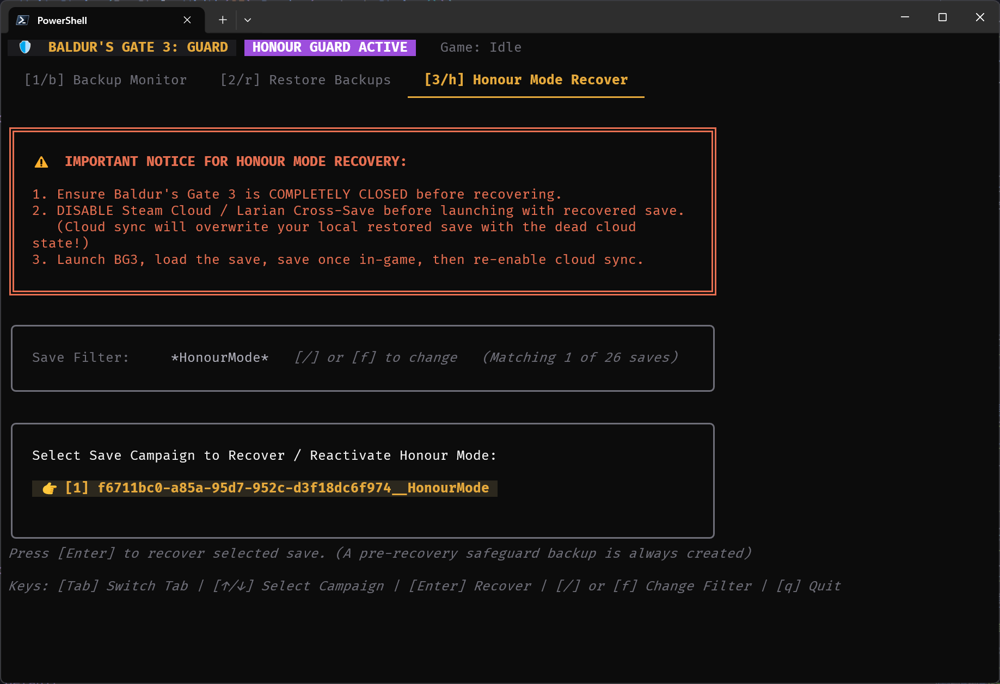

# 🛡️ BG3 Guard

<p align="center">
  
</p>

<p align="center">
  <strong>Automated Honour Mode save protection, safe rollbacks, and save recovery for Baldur's Gate 3.</strong>
</p>

[](https://goreportcard.com/report/github.com/suderio/bg3-guard)
[](https://godoc.org/github.com/suderio/bg3-guard)
[](https://opensource.org/licenses/MIT)
[](https://github.com/suderio/bg3-guard/actions)
[](https://github.com/suderio/bg3-guard/releases)
[](https://github.com/suderio/bg3-guard/releases)

<p align="center">
  <a href="https://github.com/suderio/bg3-guard/releases"></a>
  <a href="LICENSE"></a>
  
  
</p>


---

> *"Lost a 70-hour Honour Mode run because the game crashed in Act 3 while saving? Wiped to an unexpected boss legendary action of **Power Outage** and got unceremoniously kicked into Custom Mode? **BG3 Guard** is built so you never lose your hard-earned journey to the Golden Dice again."*

---

## 📸 Screenshots & Preview

> *Visual overview of BG3 Guard in action (screenshots coming soon):*

| 📊 1. Live Backup Monitor | ⏪ 2. Safe Save Restore | 🏆 3. Honour Mode Rescue |
| :---: | :---: | :---: |
|  |  |  |
| *Live countdown timer, real-time activity feed, and automated save lock detection.* | *Interactive snapshot browser with timestamped history and pre-restore safeguards.* | *1-Click reactivation of Honour Mode rules and single-save integrity after losing a save to file corruption.* |

---

## ✨ Features at a Glance

- 🕒 **Zero-Configuration Auto-Backups**: Automatically detects your Baldur's Gate 3 save directory on Windows, Linux, and Steam Deck. Just launch it and play!
- 🛡️ **Anti-Corruption & Lock Protection**: Never captures corrupted or half-written saves. Checks file locks (`ERROR_SHARING_VIOLATION`) and verifies file stability before snapshotting.
- ⏪ **Safe Transactional Restore**: Rolls back with peace of mind. Automatically takes a pre-restore backup of your current save before touching anything. If an error occurs, it rolls back automatically.
- 🏆 **True Honour Mode Save Recovery**: Resurrects saves converted to "Custom Mode" after losing a save to file corruption, restoring the original Honour ruleset, difficulty flags, and single-save campaign status.
- ⚡ **Standalone Single Executable**: Fast, lightweight **terminal user interface (TUI)**. Embeds the complete **LSLib Divine toolchain** — **no .NET runtime, PowerShell, or external dependencies required**.
- 🎮 **Steam Deck & Linux Ready**: Native Linux build with full support for Proton save paths and Steam Deck desktop mode.

---

## 🚀 Quick Start (Non-Tech Friendly)

Getting started takes less than 30 seconds:

### Step 1: Download

Head to [**Latest Releases**](https://github.com/suderio/bg3-guard/releases) and download `bg3-guard-windows-amd64.zip` (for Windows) or `bg3-guard-linux-amd64.tar.gz` (for Linux / Steam Deck).

### Step 2: Extract & Run

Unzip the file and double-click **`bg3-guard.exe`**.

That's it! BG3 Guard will:

1. Automatically find your Baldur's Gate 3 save games.
2. Create an organized backup folder inside your `Saved Games` directory.
3. Start monitoring your Honour Mode campaign every 30 minutes.

---

## 🎮 How to Use the Application

When you launch BG3 Guard, you are greeted by an interactive full-screen terminal dashboard. You can navigate effortlessly using your keyboard:

### 1. The Monitor Tab (`[1]` or `[Tab]`)

This is your main dashboard while playing Baldur's Gate 3:

- **Live Countdown**: Shows exactly when the next backup check will occur.
- **Activity Log**: Displays real-time status messages (detected saves, backups created, pruned old snapshots).
- **Instant Backup**: Press **`[Space]`** at any time to trigger an immediate backup check without waiting for the timer.

### 2. The Restore Tab (`[2]` or `[Tab]`)

Encountered a game-breaking bug or catastrophic misclick?

1. Press **`[2]`** to switch to the Restore view.
2. Select your campaign from the list.
3. Browse all timestamped snapshots. Press **`[/]`** to quickly search or filter by date/name.
4. Press **`[Enter]`** to restore.

> 💡 *BG3 Guard will warn you if the game is currently running, and will automatically preserve your current save before restoring!*

### 3. The Honour Mode Rescue Tab (`[3]` or `[Tab]`)

Did your party wipe, converting your playthrough from Honour Mode into Custom Mode?

1. Press **`[3]`** to switch to the Recovery view.
2. Select the fallen campaign folder.
3. Confirm recovery to restore the Honour Mode ruleset, re-enable the single-save requirement, and reset the dishonour flags.

> [!CAUTION]
>
> ### ⚠️ Critical: Disable Cloud Sync Before Launching Game After Recovery
>
> When recovering a save, **Steam Cloud** and **Larian Cross-Save** must be **disabled** before launching Baldur's Gate 3.
>
> *Why?* If cloud synchronization remains active, Steam or Larian servers will detect that your local save doesn't match the defeated state in the cloud and may overwrite your restored save!
>
> **Safe Recovery Routine:**
>
> 1. Turn off Steam Cloud for Baldur's Gate 3 (Right-click BG3 in Steam -> *Properties* -> *General* -> disable *Steam Cloud*).
> 2. Run the BG3 Guard recovery tool.
> 3. Launch the game and load your restored Honour Mode save.
> 4. Save once in-game.
> 5. You may now safely turn Steam Cloud sync back on.

---

## ⌨️ Keyboard Shortcuts

| Key | Action |
| :--- | :--- |
| `[Tab]` or `[1]` / `[2]` / `[3]` | Switch between Monitor, Restore, and Recover tabs |
| `[Space]` | Trigger an immediate backup check |
| `[/]` or `[f]` | Filter snapshots in Restore mode, or change campaign save filter in Recover mode |
| `[Enter]` | Confirm action (Restore snapshot or Recover save) or apply filter |
| `[Esc]` | Dismiss modal or cancel filter input |
| `[q]` or `[Ctrl + C]` | Safely exit application with retention cleanup |

---

## 📦 Installation Options

Choose the installation method that fits your setup:

### All platforms: Direct Download (Easiest)

Download the standalone `bg3-guard-[OS]-[ARCHITECTURE].[ext]` file from [GitHub Releases](https://github.com/suderio/bg3-guard/releases).

### Windows

#### Option A: Scoop (TBD) 🚧

```powershell
scoop bucket add suderio https://github.com/suderio/scoop-bucket
scoop install bg3-guard
```

#### Option B: Winget (TBD) 🚧

```powershell
winget install suderio.bg3guard
```

---

### macOS & Linux (Homebrew) (TBD) 🚧

```bash
brew install suderio/tap/bg3-guard
```

---

### Arch Linux / SteamOS (AUR) (TBD) 🚧

```bash
yay -S bg3-guard-bin
# or
paru -S bg3-guard-bin
```

---

### Debian / Ubuntu / Fedora (`.deb` & `.rpm`) (TBD) 🚧

Download the appropriate `.deb` or `.rpm` package directly from the [Releases page](https://github.com/suderio/bg3-guard/releases), then install:

```bash
# Debian / Ubuntu
sudo dpkg -i bg3-guard_*_linux_amd64.deb

# Fedora / RHEL
sudo rpm -i bg3-guard_*_linux_amd64.rpm
```

---

## ⚙️ Advanced Usage & CLI Flags (Power Users)

For users who want to customize backup intervals or run BG3 Guard as a headless background service:

### Command Line Flags

Any flag provided in your terminal updates your configuration and **automatically persists across sessions**:

```powershell
# Change check interval to every 15 minutes and keep the 5 latest backups per campaign:
.\bg3-guard.exe -i 15 -r 5

# Set custom backup destination folder:
.\bg3-guard.exe -d "D:\MyBackups\BaldursGate3"

# Check version and build details:
.\bg3-guard.exe --version
```

### CLI Subcommands

Run without the TUI interface (ideal for headless servers or scheduled scripts):

```powershell
# Headless backup monitor daemon:
.\bg3-guard.exe backup

# Interactive command-line restore prompt:
.\bg3-guard.exe restore

# Interactive command-line Honour Mode rescue:
.\bg3-guard.exe recover
```

---

## 🛠️ Building from Source

Prerequisites: **Go 1.22+** and **Make**.

```bash
# Clone the repository
git clone https://github.com/suderio/bg3-guard.git
cd bg3-guard

# Download divine toolchain and compile binary:
make

# Run automated test suite:
make test

# Check for new versions of Go dependencies and LSLib Divine:
make check-updates
```

---

## 📜 Disclaimer & Caveat Emptor

> [!WARNING]
> **PLEASE READ CAREFULLY BEFORE USING THIS SOFTWARE:**
>
> 1. **AI Development Disclaimer**: This project was developed and engineered with the assistance of **Google Antigravity** and **Google Gemini** advanced agentic coding systems.
> 2. **Not an Official Larian Product**: BG3 Guard is an independent open-source fan project and is **not affiliated with, endorsed by, or connected to Larian Studios or Wizards of the Coast**. *Baldur's Gate 3* is a registered trademark of Larian Studios.
> 3. **Caveat Emptor**: This software modifies and reads local game files on your system. While extensive automated safeguards, verification checks, and transactional rollbacks are implemented to protect your data, **the software is provided "AS IS", without warranty of any kind, express or implied**.
> 4. **Backup Responsibility**: You are solely responsible for your save files. Although BG3 Guard creates safety copies automatically, we always advise creating your own periodic manual backups of your `Savegames` directory before attempting any save modification.
> 5. **Multiplayer Warning**: While single-player Honour Mode save recovery has been extensively tested, multiplayer campaigns involve network session synchronization that may behave unpredictably. Use extra caution in multiplayer.

---

## 📄 License

Distributed under the **MIT License**. See [LICENSE](LICENSE) for full details.

---

## 🙏 Acknowledgements & Credits

- [Norbyte's LSLib](https://github.com/Norbyte/lslib) — the incredible toolchain that powers Baldur's Gate 3 package extraction and resource conversion.
- [HonourSaver by nay-cat](https://github.com/nay-cat/HonourSaver) — for inspiring the Honour Mode metadata recovery workflow.
- [Charmbracelet (Bubble Tea & Lip Gloss)](https://charm.sh/) — for the terminal interface libraries.
